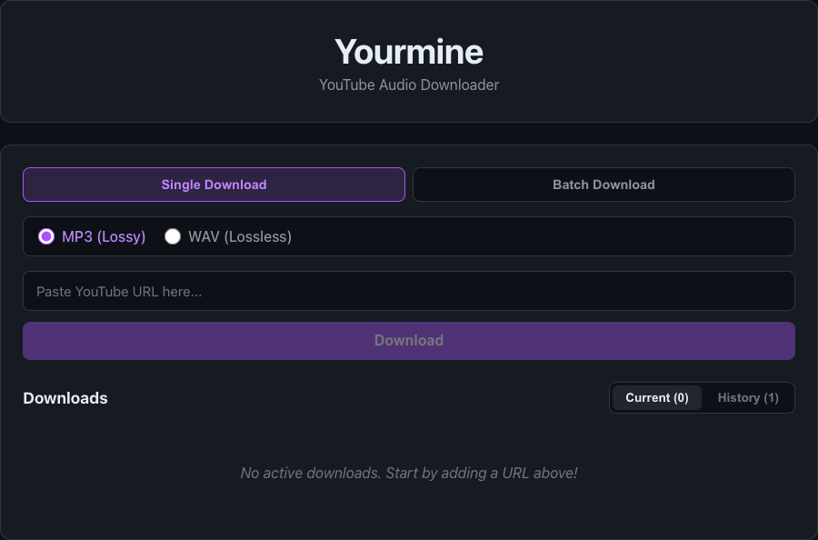

# YourMine - YouTube Audio Downloader

Web interface for downloading audio from YouTube videos and playlists.



## Features

- Download audio from YouTube videos
- Batch download from playlists
- Choose between MP3 (lossy) and WAV (lossless) formats
- Real-time progress tracking
- Conversion status monitoring
- Direct download to ~/Downloads folder
- Download history with localStorage persistence
- Dark UI inspired by GitHub, with purple accents
- Full E2E test coverage (25 tests)
- Code quality checked with SonarQube (SonarLint)

## Quick Start with Docker

The easiest way to run YourMine is with Docker Compose:

```bash
# Start the application
docker compose up

# Rebuild after changes
docker compose up --build
```

To stop the application:

```bash
docker compose down
```

## Development Setup (without Docker)

### Prerequisites

- Python 3.11+
- Node.js 20+
- FFmpeg

### Backend

```bash
python3 -m venv venv
source venv/bin/activate
pip install -r requirements.txt
python -m backend.api
```

### Frontend

```bash
cd frontend
npm install
npm run dev
```

### Running Tests

```bash
# Install Playwright
npx playwright install

# Run all E2E tests
npx playwright test

# Run tests in UI mode
npx playwright test --ui
```

## Tech Stack

- **Backend**: FastAPI, yt-dlp, Python 3.11
- **Frontend**: React 18, TypeScript, Vite 5
- **Testing**: Playwright (25 E2E tests)
- **Code Quality**: SonarQube / SonarLint
- **Containerization**: Docker, Docker Compose

## Project Structure

```
yourmine/
├── backend/
│   ├── api.py              # FastAPI application and REST endpoints
│   └── downloader.py       # Core download and conversion logic
├── frontend/
│   └── src/
│       ├── components/     # React UI components (TSX)
│       ├── hooks/          # Custom React hooks (TS)
│       ├── utils/          # Utility functions (TS)
│       ├── types.ts        # Shared TypeScript type definitions
│       ├── App.tsx         # Main application component
│       └── main.tsx        # Entry point
├── tests/
│   └── e2e/                # Playwright E2E tests (TS)
├── yourmine.py             # CLI tool
├── docker-compose.yml      # Docker orchestration
├── Dockerfile.backend      # Backend Docker image
├── Dockerfile.frontend     # Frontend Docker image
└── requirements.txt        # Python dependencies
```

## Architecture

- Downloads are saved directly to `~/Downloads` folder
- No server-side file storage
- Real-time progress tracking via polling
- Status progression: queued → extracting → downloading → converting → completed

## API Endpoints

- `POST /download` - Start a single download
- `POST /download/batch` - Start batch downloads
- `GET /downloads` - List all downloads with status

Full API documentation: http://localhost:8000/docs

## CLI Usage

Download to current directory as MP3:
```bash
python yourmine.py https://www.youtube.com/watch?v=dQw4w9WgXcQ
```

Download to specific folder as WAV:
```bash
python yourmine.py https://youtu.be/dQw4w9WgXcQ --output ~/Music --format wav
```

Batch download from file:
```bash
python yourmine.py --file urls.txt --format wav --workers 5
```

## Supported URL Formats

- `https://www.youtube.com/watch?v=VIDEO_ID`
- `https://youtu.be/VIDEO_ID`
- `https://www.youtube.com/watch?v=VIDEO_ID&list=PLAYLIST_ID`

## License

MIT
