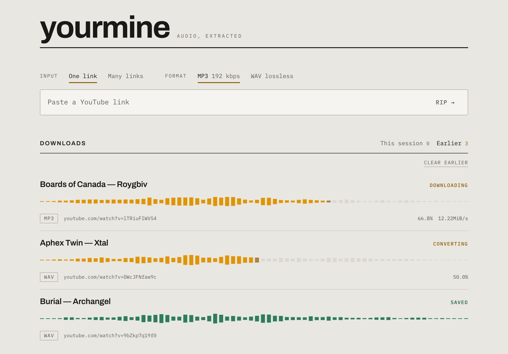

# Yourmine — YouTube Audio Downloader

Paste a YouTube link, get an MP3 or WAV in your Downloads folder. Web interface,
CLI, and a Docker Compose stack.



## Features

- Download audio from YouTube videos, one link or a list at a time
- Choose between MP3 (192 kbps) and WAV (lossless)
- Live progress: each download draws its own waveform as it fills
- Files land straight in `~/Downloads` — nothing is stored server-side
- Download history kept per browser session
- CLI for scripting and batch files
- 91 backend unit tests, 71 frontend unit tests, 25 end-to-end tests

## Quick start with Docker

```bash
docker compose up          # start
docker compose up --build  # rebuild after changes
docker compose down        # stop
```

The UI is at http://localhost:3000. Both containers run as non-root and are
published on loopback only.

## Development setup

### Prerequisites

- Python 3.11+
- Node.js 20+
- FFmpeg

### Backend

```bash
python3 -m venv venv
source venv/bin/activate
pip install -r requirements-dev.txt
python -m backend.api
```

### Frontend

```bash
cd frontend
npm ci
npm run dev
```

### Tests and checks

```bash
# Backend
ruff check . && ruff format --check .
pytest --cov=backend --cov-report=term-missing

# Frontend
cd frontend
npm run lint && npm run typecheck && npm run test && npm run build

# End-to-end (starts both servers itself)
npx playwright test
```

## Configuration

All backend settings are environment variables with a `YOURMINE_` prefix. See
[`.env.example`](.env.example) for the full list and defaults.

| Variable | Default | Purpose |
|---|---|---|
| `YOURMINE_HOST` | `127.0.0.1` | Interface to bind. Loopback by default — the API has no authentication, so exposing it to a network is an explicit opt-in. |
| `YOURMINE_PORT` | `8000` | Port to listen on |
| `YOURMINE_OUTPUT_DIR` | auto | Where files are written. Unset auto-detects `~/Downloads`, then `~/Desktop`, then `~`. |
| `YOURMINE_MAX_BATCH_SIZE` | `20` | Maximum URLs in one batch request |
| `YOURMINE_MAX_CONCURRENT_DOWNLOADS` | `3` | Downloads running at once |
| `YOURMINE_MAX_STORED_JOBS` | `200` | Job history retained in memory |
| `YOURMINE_LOG_LEVEL` | `INFO` | `DEBUG`, `INFO`, `WARNING`, `ERROR` |

The frontend reads `VITE_API_URL` (see [`frontend/.env.example`](frontend/.env.example)).
Vite inlines it at build time, so the Docker image takes it as a build argument.

## Architecture

```
backend/
  api.py          FastAPI routes only; dependencies wired with Depends()
  service.py      Job orchestration, free of any HTTP concern
  store.py        Thread-safe, size-capped job store with eviction
  downloader.py   yt-dlp adapter
  models.py       Request/response models + the DownloadState enum
  validation.py   YouTube URL allowlist
  config.py       Settings, read from the environment
frontend/src/
  components/     UI components, one CSS Module each
  hooks/          useDownloads (polling, job state), useToast
  utils/          Progress parsing and status mapping
  styles/         Design tokens
tests/
  backend/        pytest suite
  e2e/            Playwright suite
docs/adr/         Architecture decision records
```

- `DownloadState` in `backend/models.py` is the single source of truth for
  status values; a test asserts the frontend's TypeScript union still matches.
- Progress reaches the browser by polling — see
  [ADR 0002](docs/adr/0002-polling-over-websockets.md).
- Job history is in memory and bounded — see
  [ADR 0001](docs/adr/0001-in-memory-job-store.md).

## Security

Yourmine is built for local, single-user use, and the defaults reflect that:

- **URLs are restricted to YouTube.** `yt-dlp`'s generic extractor will fetch
  any host it is given, so the API validates every URL against an exact-host
  allowlist and a video-ID check before the downloader sees it.
- **The API binds to loopback** and has no authentication. Set `YOURMINE_HOST`
  only if you understand that anyone who can reach the port can write files into
  your output directory.
- **Batch size and concurrency are capped** so a single request cannot exhaust
  the process.
- **Errors are sanitised** — the client gets a stable message, and the full
  yt-dlp output goes to the server log.

If you plan to run this anywhere other than your own machine, add
authentication, rate limiting, and per-session job scoping first.

## API

- `POST /download` — start one download
- `POST /download/batch` — start several
- `GET /downloads` — list all jobs, newest first

Interactive docs: http://localhost:8000/docs

## CLI

```bash
# Single video to the current directory as MP3
python yourmine.py https://www.youtube.com/watch?v=dQw4w9WgXcQ

# Specific folder, lossless
python yourmine.py https://youtu.be/dQw4w9WgXcQ --output ~/Music --format wav

# Batch from a file, 5 at a time
python yourmine.py --file urls.txt --format wav --workers 5
```

## Supported link formats

`youtube.com/watch?v=ID` · `youtu.be/ID` · `youtube.com/shorts/ID` ·
`youtube.com/embed/ID` · `youtube.com/live/ID`, on `youtube.com`, `www`, `m`,
and `music` hosts.

Playlists are not expanded — each link downloads exactly one video. Pass a batch
of links to download several.

## Roadmap

- [x] FastAPI backend with yt-dlp, MP3 and WAV output
- [x] React + TypeScript frontend with live progress
- [x] CLI with parallel batch downloads
- [x] Docker Compose stack
- [x] Playwright end-to-end suite
- [x] Working ESLint + Prettier + Ruff toolchain
- [x] Unit tests: pytest (backend) and Vitest (frontend)
- [x] GitHub Actions CI, CodeQL, and Dependabot
- [x] CD publishing images to GHCR
- [x] Restrict downloads to YouTube hosts (SSRF fix)
- [x] Layered backend with dependency injection and structured logging
- [x] "Signal" visual redesign with the waveform progress meter
- [ ] Enable branch protection on `main` (requires repo admin)
- [ ] Cancel a download in progress
- [ ] Choose the output directory from the UI
- [ ] Optional playlist expansion behind an explicit flag
- [ ] Persist history across restarts (revisits ADR 0001)

## License

MIT
